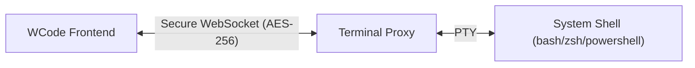

# WCode Terminal Proxy

English | [中文](./README.zh-CN.md)

A secure WebSocket-to-PTY bridge for [WCode](https://github.com/KkSss999/wcode). This project provides the backend infrastructure for WCode's terminal capabilities, allowing real system-level terminal interaction through a secure WebSocket connection.

## Features

- **Secure Communication**: Uses AES-256-GCM encryption for End-to-End Encryption (E2EE) between the client and the proxy.
- **PTY Support**: Built on `portable-pty` to provide cross-platform pseudo-terminal support (Windows, Linux, macOS).
- **WebSocket Interface**: Exposes a WebSocket endpoint for real-time terminal IO.
- **Session Management**: Handles multiple terminal sessions securely.
- **High Performance**: Built with Rust, Axum, and Tokio for optimal performance and low latency.

## Architecture

This proxy acts as a bridge between the WCode frontend (running in a browser) and the host operating system's shell.



## Getting Started

### Prerequisites

- Rust (latest stable)
- Cargo

### Installation

```bash
git clone https://github.com/KkSss999/wcode-terminal-proxy.git
cd wcode-terminal-proxy
cargo build --release
```

### Usage

Start the server:

```bash
cargo run --release
```

The server will start on the configured port (defaulting to 3001 or as specified in environment variables).

## Configuration

Configuration is primarily handled via environment variables or command-line arguments (implementation dependent).

| Variable | Description | Default |
|----------|-------------|---------|
| `PORT` | The port to listen on | `3001` |
| `WCODE_SECRET` | Secret key for authentication | (Generated if missing) |

## Security

This project implements several security measures:
- **E2EE**: Payloads are encrypted to prevent inspection by intermediaries.
- **Input Filtering**: Basic sanitization of input streams.
- **Origin Validation**: Ensures connections originate from trusted sources.

## License

Copyright © 2026 NomoAIT (Guangzhou Maoyi Technology Co., Ltd)

Licensed under the Apache License, Version 2.0. See [LICENSE](./LICENSE) for details.
